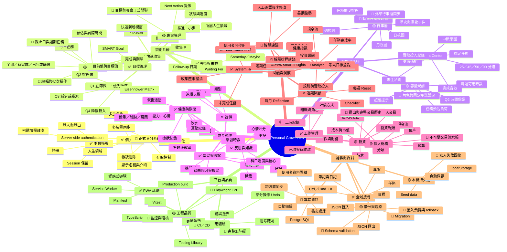
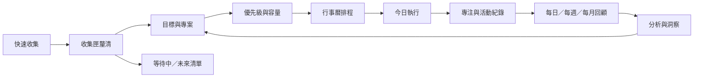
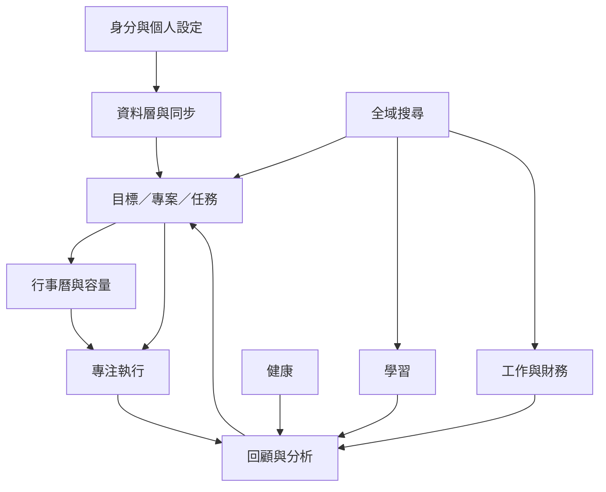

# Personal Growth OS 功能心智圖

此圖以產品功能為中心，依目前程式碼與開發計畫整理。狀態標記如下：

- ✅ 已完成：已有可操作功能。
- 🟡 部分完成：已有 MVP，但仍需補齊完整流程或可靠性。
- 🔵 規劃中：列入後續開發路線圖。

## 核心功能循環

## 功能依賴關係

> GitHub、GitLab 及支援 Mermaid 的 Markdown 閱讀器可直接渲染以上圖表；若閱讀器不支援，仍可由縮排文字理解完整層級。
